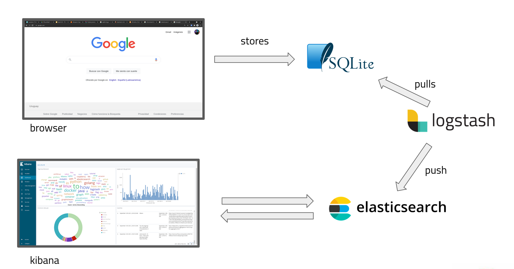

# Send your chrome's browsing history data to elasticsearch for analyzing it!

This project was created for understanding how logstash, elasticsearch and kibana works, for sure MS Excel is more than enought for analizing and storing browsing data.

### Architecture


### Usage
0. [Create](#create-elasticsearch-index) an index in your elasticsearch cluster for storing each row of your chrome database.
1. Reame the docker-compose.example.yml to docke-compose.yml
2. Add the required information to this file:
	-	The address to the elasticsearch cluster.
	-	elasticsearch user and password
	-	path to the chome history database, you can find where is located in your system [here](https://stackoverflow.com/questions/8936878/where-does-chrome-save-its-sqlite-database-to).
	-	path to the folder where to store a file that records the last row sended to elasticsearch on the last run.
	-	add the name of the index you created in 0.
3. docker-compose up

If everything worked as expected, now you have your browsing data in elasticsearch ready for being analyzed!


#### Create elasticsearch index:

```
curl -XPUT "<elasticsearch server url>/<name of the index specified in docker-compose file>" -H 'Content-Type: application/json' -d'
{
    "doc": {
      "properties": {
        "tiempo": {
          "type": "date",
          "format": "yyyy-MM-dd HH:mm:ss"
        },
        "visit_id": {
          "type": "long"
        },
        "terms": {
          "type": "text",
          "fielddata": true,
          "fields": {
            "keyword": {
              "type": "keyword",
              "ignore_above": 256
            }
          }
        },
        "page_title": {
          "type": "text",
          "fielddata": true,
          "fields": {
            "keyword": {
              "type": "keyword",
              "ignore_above": 256
            }
          }
        },
        "url": {
          "type": "keyword"
        },
        "url_id": {
          "type": "long"
        }
      }
  }
}'
```
